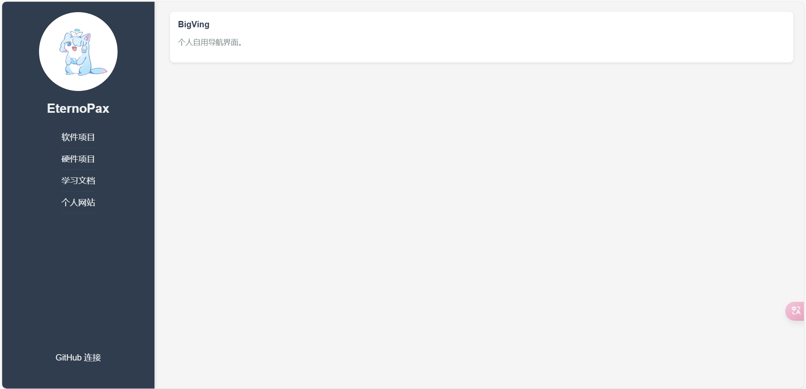
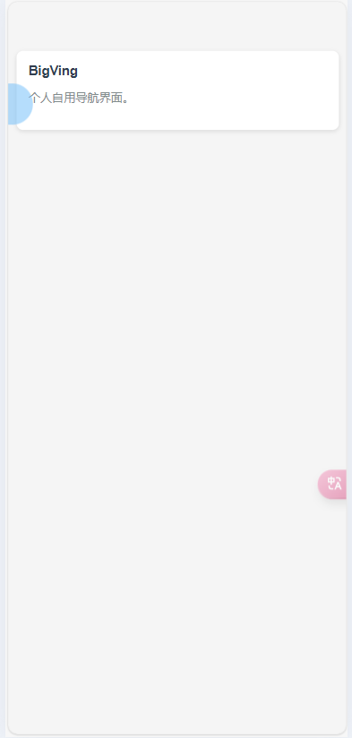

:happy:这里是EternoPax,这是一个轻易上手的个人博客网页!任何人都可以轻松上手部署一个的个人博客.:happy:

## 项目效果





## 项目上手说明

首先介绍一下项目目录!

```
BLOG/
├── content/
│   └── learning/
├── download/
│   └── learning/   
├── server/
│   ├── node_modules/
│   ├── package-lock.json
│   ├── package.json
│   ├── server.js
├── avatar.jpg
├── CopyRight.png
├── index.html
├── Readme.md
├── script.js
├── start.bat
├── styles.css
```

在`index.html`中我们可以修改下列内容

- 网站标题

找到:

```html
<title>个人博客</title>
```

可以将中间内容换成你的网站名

- 网站图标

找到

```html
<link rel="icon" type="image/png" href="CopyRight.png">
```

修改最后的`href`成对应的图片路径即可

- 用户图像

用户自定义图像,替换`avatar.jpg`文件,请确保文件名一致,包括文件后缀.如果无法修改,请修改`index.html`中,找到

```html

```

修改它的src,保证和你文件的地址一致.

- 用户名

找到:

```html
<h2 id="username">用户名</h2>
```

改变中间的名字就行

- 左侧栏选项

```html
		  <a href="#software" data-section="software">软件项目</a>
          <a href="#hardware" data-section="hardware">硬件项目</a>
          <a href="#learning" data-section="learning">学习文档</a>
          <a href="#website" data-section="website">个人网站</a>
```

通过添加下列语句既可:

```html
<a href="#key" data-section="key">value</a>
```

请保证`key`的唯一性

- 跳转连接

```html
<a href="your's link" target="_blank" class="github-link">Name</a>
```

对应替换即可

在`script.js`中我们可以修改下列内容

- 右侧栏概览块

找到:

```js
function loadOverview(section) {
  const overview = {
    software: [
     { title: "test", desc: "test" ,dir: [".zip", ".pdf"]},
    ],
    hardware: [
      { title: "test", desc: "test" ,[]},
    ],
    learning: [
      { title: "test", desc: "test" ,[".zip"]},
    ],
    website: [
      { title: "test", desc: "test",dir:[".zip"]},
    ],
  };
```

其中,一个对应了左侧栏选项的key,`{}`里的对应了概览块的内容.`title`为概览块标题,`desc`是概览块的简介,`dir`是可下载文件的猴嘴,在`download`中可以部署下列内容,对应的显示内容应放在:`content/key/title`文件夹下,网站将自动生成连接

- 右侧栏内容

需要在`content`和`download`中部署

在`content`中可以部署下列内容

对应的显示内容应放在:`content/key/title.html`.例如学习文档(对应`key`为`learning`)中的test应该放在:`content/learning/test.html`.如果是`markdown`文本,请转为`html`文件.如果`html`文件中有`img`,保证地址为:

```html
"/content/key/"+该html下的相对path
```

**其他文件可以不进行修改.**